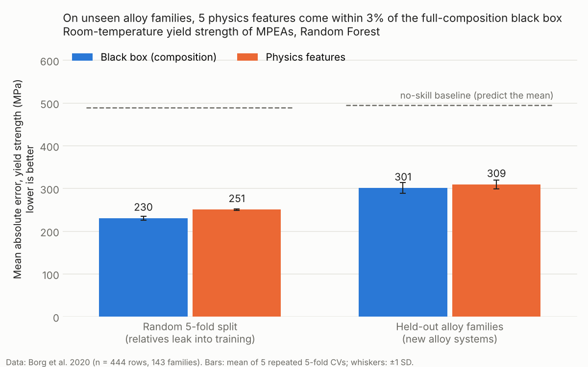

# Do dislocation-physics features predict alloy strength better than a black box?

**Status: first result (v0.1).** One notebook, one chart, one answer. Next steps below.

## Question
Multi-principal-element alloys (MPEAs, incl. high-entropy alloys) are strengthened
largely by solute–dislocation interactions. Classical theory points to a few
physical drivers: atomic size misfit, shear modulus mismatch, and valence electron
concentration (VEC).

This project tests one question:
**Can a small set of physics-based features predict MPEA yield strength as well as,
or better than, a black-box model on raw composition — when tested on alloy
families the model has never seen?**

## Short answer
**As well as, not better.** On held-out alloy families, 5 physics features reach the same
accuracy as the full composition vector (R² = 0.50 for both; mean absolute error 309 vs 301 MPa,
a difference inside run-to-run noise). Physics features never clearly beat the black box.

Two further findings:
- **Random splits flatter the models.** Errors rise by 31% (black box) and 23% (physics)
  when whole alloy families are held out. Random-split scores overstate how well either
  model would do on a new alloy system.
- **The physics model loses less when moving to new families.** Its lead feature is VEC,
  which tracks the BCC-vs-FCC split (strong refractory BCC alloys vs softer FCC alloys).



| Validation | Model | MAE (MPa) | R² |
|---|---|---|---|
| Random 5-fold | Mean predictor (no skill) | 489 | −0.01 |
| Random 5-fold | Black box (composition) | **230** ± 5 | 0.71 |
| Random 5-fold | Physics features | 251 ± 2 | 0.64 |
| Held-out families | Mean predictor (no skill) | 495 | −0.03 |
| Held-out families | Black box (composition) | **301** ± 13 | 0.50 |
| Held-out families | Physics features | 309 ± 10 | 0.50 |

± = standard deviation over 5 repeated 5-fold cross-validations. Paired over the same folds,
physics minus black-box MAE is +20 MPa on random splits (physics worse in every repeat) and
+8 MPa on held-out families (ranging from −13 to +20, i.e. no consistent winner).
Full numbers: [`results/results_table.csv`](results/results_table.csv).

## Data
Borg et al. (2020), *Expanded dataset of mechanical properties and observed phases
of multi-principal element alloys*, Scientific Data 7, 430.
https://doi.org/10.1038/s41597-020-00768-9 — data from
[CitrineInformatics/MPEA_dataset](https://github.com/CitrineInformatics/MPEA_dataset) (Apache-2.0),
loaded at a pinned commit. No data is stored in this repo.

## Method
1. **Clean.** Keep yield-strength records tested at room temperature (15–30 °C): 722 records.
   Drop alloys containing carbon (an interstitial, outside the substitutional misfit picture): 699.
   Collapse repeated measurements to the median per (alloy, test type, processing route):
   **444 rows, 375 alloys, 143 families**.
2. **Alloy family** = the set of elements present, ignoring proportions
   (e.g. all Al<sub>x</sub>CoCrFeNi variants are one family).
3. **Black-box features:** atomic fractions of 26 elements.
4. **Physics features (5):** size misfit δ, shear-modulus mismatch δG, VEC, mean shear modulus Ḡ,
   and a Varvenne–Curtin-type term Ḡ·δ<sup>4/3</sup>, computed from a small elemental table in the notebook.
5. **Shared context (both models):** test type (tension/compression) and processing route,
   so the two models differ only in how composition is represented.
6. **Learner:** Random Forest (500 trees, scikit-learn), identical for both feature sets.
7. **Validation:** random 5-fold vs **GroupKFold by alloy family** (5 folds), each repeated
   with 5 shuffles; a mean predictor gives the no-skill reference.

## Limitations
- Elemental radii and shear moduli are approximate handbook values; one cited table would be better.
- Room temperature only; temperature dependence is not modelled yet.
- Processing and microstructure are coarse labels; grain size and interstitial content are mostly missing.
- Records come from many labs; measurement scatter limits any model's accuracy.

## Next steps
- Combine both feature sets and test whether physics adds information on top of composition.
- Add test temperature as a feature (the dataset covers −269 to 1600 °C).
- Replace the elemental table with a single cited source and check sensitivity to it.
- Add uncertainty estimates per prediction.
- A small neural-network baseline (PyTorch) for comparison, planned for a later version.

## Reproduce
```bash
pip install -r requirements.txt
jupyter notebook 01_physics_vs_blackbox.ipynb   # downloads the data on first run, ~1–2 min
```

## Author
Anshuman Choudhury  (PhD Computational Materials Science) (Université Paris-Saclay / CEA),
atomistic simulation of dislocation dynamics in BCC metals.
